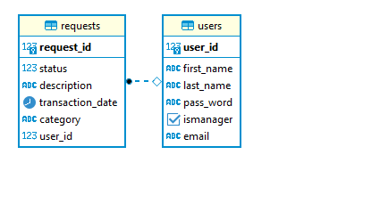

Expense Reimbursement System (ERS)

Project 1 is an individual project be based off of an employee expense reimbursement system (or similar*). It is a full stack application utilizing HTML, CSS, and JavaScript on the frontend and a Java application on the backend. This Java application utilizes Servlets to process user requests from the front end. The following user stories are achieved in the application:

---

- An Employee can login
- An Employee can view the Employee Homepage
- An Employee can logout
- An Employee can submit a reimbursement request
- An Employee can view their pending reimbursement requests
- An Employee can view their resolved reimbursement requests
- An Employee can view their information (profile)

---

- A Manager can login
- A Manager can view the Manager Homepage
- A Manager can logout
- A Manager can approve/deny pending reimbursement requests
- A Manager can view all pending requests from all employees
- A Manager can view all resolved requests from all employees and see which manager resolved it
- A Manager can view all Employees

---

- Some testing
- Logging using log4j 

---

- An Employee receives an email when one of their reimbursement requests is resolved
- A Manager can register an Employee, which sends the Employee an email with their username  and temp password
- An Employee can reset their password
- Including visual aids, such as charts showing spending categories or spending over time

---

Technologies:

- Java 1.8
- Servlets
- JDBC
- SQL
- HTML
- CSS
- Javascript
- Bootstrap (Optional)
- AJAX
- JUnit
- log4j 

---

ERD:

----